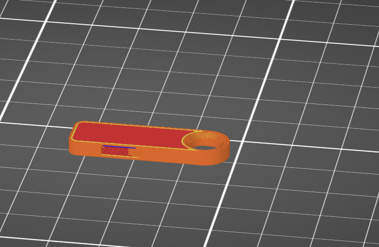
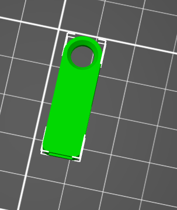

# L2 Design and Slicing 

## DfAM Research   
One design rule that we can use is to design for minimum usage, this means when companies are creating materials they should only use what is necessary for that projects creation, this is critical because it can save on cost and time in the industry.   
Using too much material for lighter weight components can be a huge time loss for companies as well a huge money hole when things don't work out.    

Added from group-   
The designers have to pay attention to how the part sits on a plate otherwise the print could get messed up during the printing process. Self supporting angle should be at minimum of 45, 

## FDM Research 
One fdm specific consideration is where the holes should be printed, holes should be printed normal to the x-y plane because the path the 3d printer follows is circular in design.  
Another thing to consider is that the holes you create for your 3d print should have supports for your print as they won't be able to stand alone. 

Added from group-  
The infill of your project is important so your project won't be too light, and to keep your base warm so it won't warp. Keep overhand to be less than 45 degrees or add a support to help with overhang. 

##Print Something Small  
I downloaded a whistle( https://www.printables.com/model/1190062-xxxs-whistle-small-but-loud-4min-print/comments) from printables. I choose the whistle because I wanted the first thing I designed to not be something I could forget about with the functionality aspect it makes the whistle the best option in my opinion.   
  
The file chosen was perfect falling right in the allotted tolerance being only a 0.07 in by 0.007 in print.  
  
