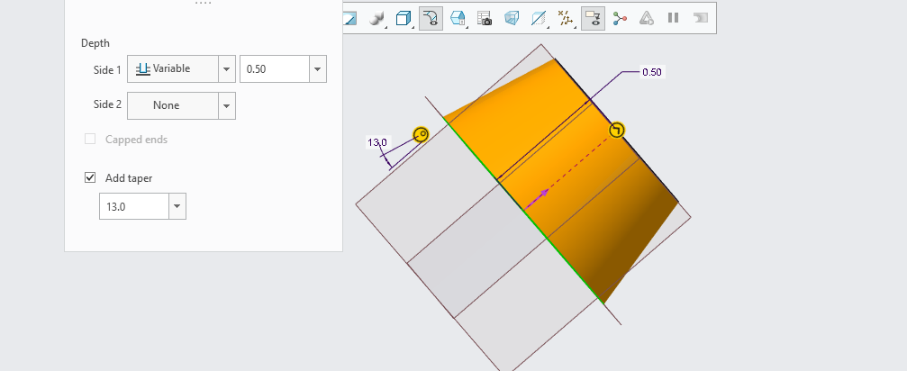
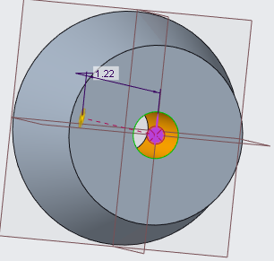
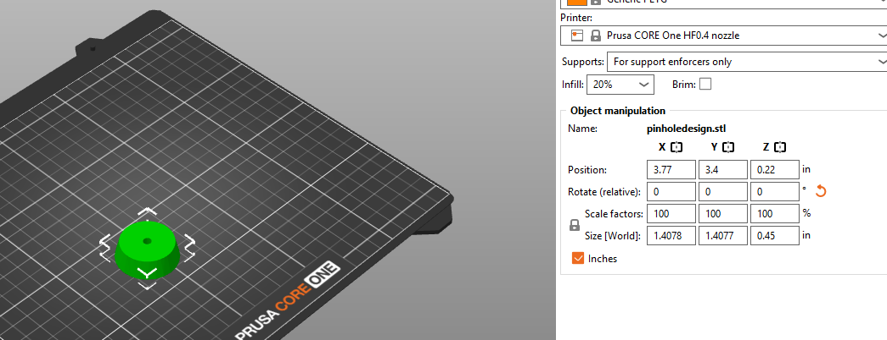

# A3 – Design And Make Something

## Research 
<ins>Three filaments not discussed</ins> 
<ol>
  <li>Monotonic - used to create a smooth uniform finish for prints.</li>
  <li>Hilbert Curve - used to reduce internal cooling.</li>
  <li>Octagonal Spiral - used for stunning visual effects.</li>
</ol>

The higher the infill percentage you have the longer a print will take and the more dense it will be. Different infill patterns affect this density and they can either make the final print more compact or less compact. 

## Design

When I thought about my design I chose to create a exposure increaser for my iPhone camera. I knew the design would have to be something within the parameters (1.5 by 1.5 inches and 0.5 inches long). Thanks to those parameters I was able to make a basic circle with a small pin hole to allow more light to enter the camera of my photo. 

This cad file is what I would being with just a basic circle ensuring I reach the specifications of the design. 

This shows me creating the pinhole to the optimal length so I can use this within the design specifcations. 

This photo shows the tapper on my extrude, this allows for a more cone shape at the end of the design and a more circular edge to fit into my photo. 

  

This is the final hole the one that will allow light into the camera and allow for the camera to use its internal settings to match more light and create an over exposed effect when pictures are taken. 

<ins>This file was then saved as an stl file to be used in prusa slicer.</ins>

## Preprocessor and Printing 

Thankfully the print didn't have to change orientation as it came right side up. I as well did not need to scale my print as it was perfectly within the parameters as shown by the x y and z coordinates. The infill used in my final print was triangles which was different from the normal printing process. This was used as my print was already like a solid object so if I didn't use something like this it would add extra time to the printing process that wouldn't be needed. The wall thickness was changed to .02 inches due to the fact that if I added more it would create a bigger time and throw my team off of our time schedule. One mistake that happened is the printer malfunctioned during my teams printing process. 

## Print   

Below is a video of my printing process and my print being created after the new filament was put in. 
<video width="640" height="360" controls poster="thumbnail.jpg">
  <source src="IMG_7226 (1).mp4" type="video/mp4">
</video>

