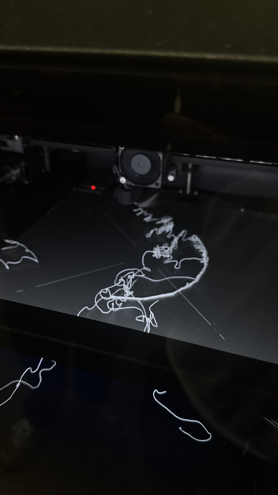
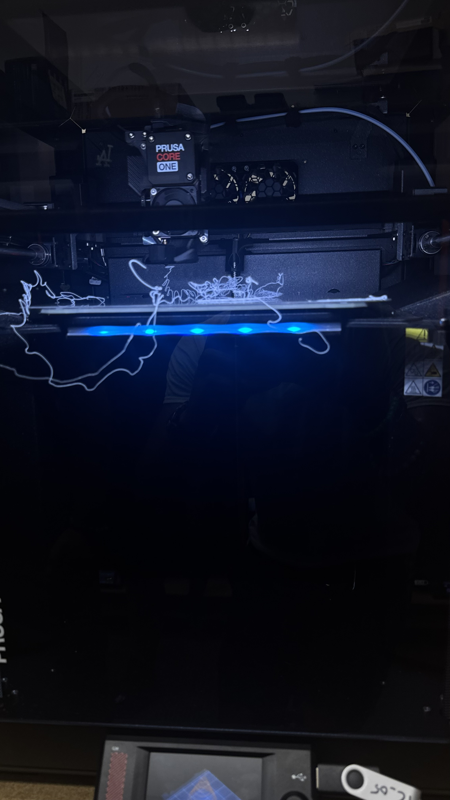
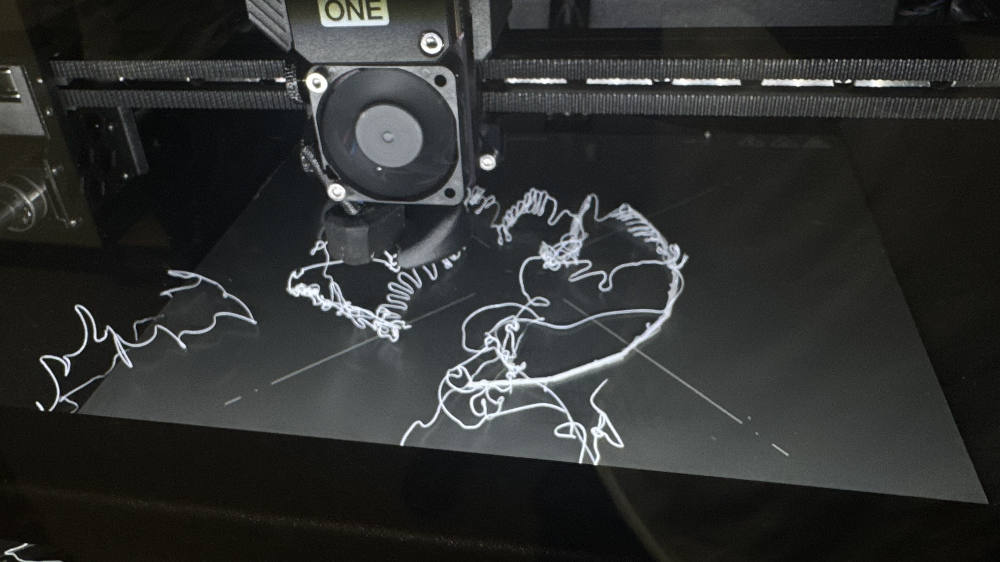

# A4 – [Benchmark A Parameter]

## Design -  

Last week for the lab three *Design something small lab* I made an aperture controller for my phone. This week I decided to improve on that earlier design by making a harsher sweep and testing how Prusa would react when it was tested for harsher angels to do this I created a rough outline of what I wanted the camera modulus to look like and exported the file to prusa as shown below. 

  <figure>
     
    <figcaption> This is what I started with a straight line adjusted for a futher pitch as we get towards the end</figcaption>
  </figure>
  
<figure>
    
  <figcaption> This is whats shown in creo after part creation using the sweap as a reference for my line</figcaption>
</figure>  

## Preprocessor 
**Prusa**  

Next I would move onto the slicing of this image by exporting the spiral as a stl file for prusa to accept.  
<figure>
  
  <figcaption>This is how the final design looked in prusa</figcaption>
</figure>  

Here I would make a mistake and not add any supports to my design it would be important to keep the print from doing what it eventually would. 
I didn't think anything of it at the time as we were designing for failure but in this failure I changed my test from how small a sweep could be into how the printer would design an object at high temps. Due to the high temp my print would melt and mend together creating an amalgamation I didn't want. 

**Whats shown** 
<ul>
  <li>First we can see the image created from creo which is a half scale model to fit in prusa</li>
  <li>Secondly we can see that I changed the supports to be none which was something I shouldn't have done</li>
  <li>Thirdly we can see that prusa is telling me to change this to add more supports for my object</li>
  <li>No Infill was chosen at all and build orientation was picked upright as it was the best for the final build</li>
</ul>

## Printing

<figure>
  
  <figcaption> The first 10 minutes of the print already messing up</figcaption>
  
  <figcaption>This is the second image I have of the printing </figcaption>
  
  <figcaption> This is the third image I have of the printing at this point I decided it was enough and couldn't be fixed</figcaption>
</figure>

<video src="Untitled design.mp4" width="400" height="400" controls></video>

## Things Learned
<ul>
  <li> Supports should always be used</li>
  <li> The harsher the sweep the longer the printing time</li>
  <li> The PETG heat requirement can be harsh on more detailed prints</li>
</ul>

## Resources 
<ul>
  <li><a href="https://uncc.instructure.com/eportfolios/2988/Assignments/Characterize_Some_Parameter">Example Lab</a></li>
  <li><a href="https://www.youtube.com/watch?v=hDeecUNinHk">Spiral Builder</a></li>
  <li><a href="https://www.youtube.com/watch?v=tUjjLafon_E&t=9">Spiral Part maker </a></li>
</ul>

