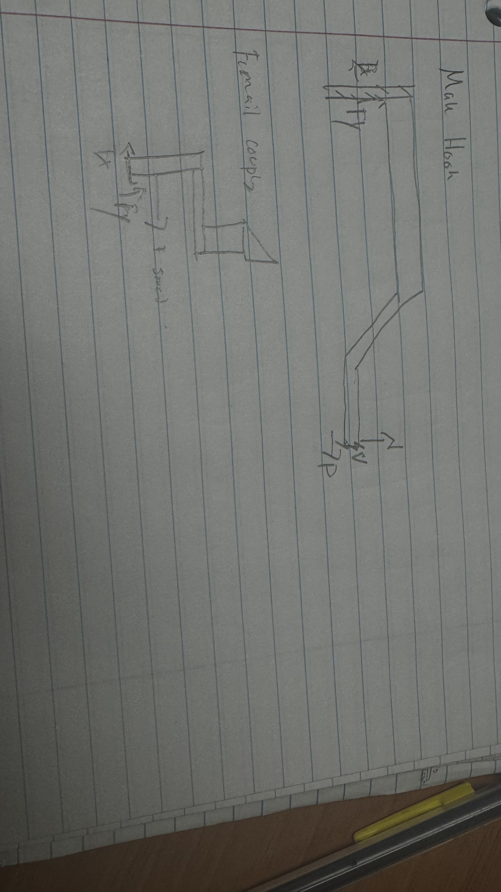
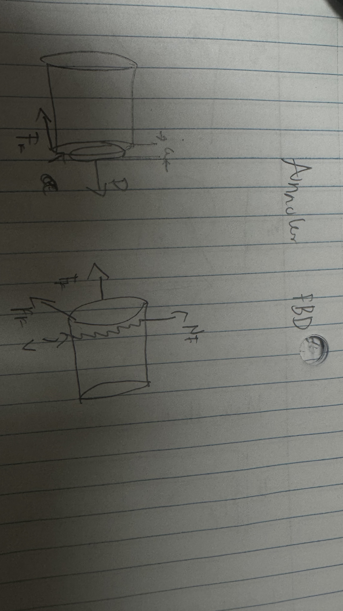
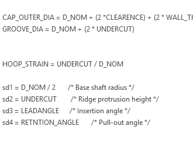
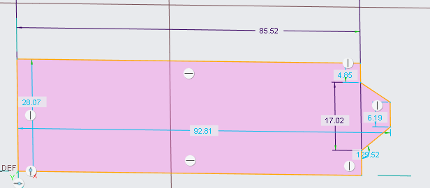
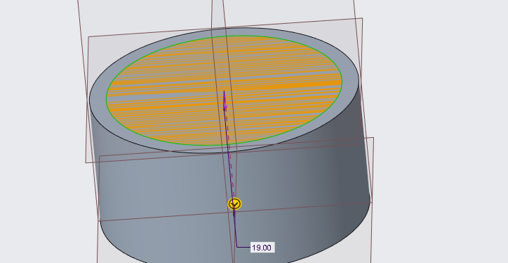

# A5 – [Design a Snap Fit]

## Modeling

When initially deciding to create a snap fit design I thought I would create a beam design after finding the common Youngs modulus of pla to be 2.4 GPA and a common yield strength of 8,500 psi. I calculated the max allowed strength to be around 2,430 psi. 
After finding this I began to work on my first design the cantilever beam. To find the length of this beam I used the equation L = sqrt(3*y*t/2*e) or the straight beam calculation.  

<figure>
  
  <figcaption><i> Figure 1: This is the first freebody diagram.</i></figcaption>
</figure>  

After designing this though I decided that I didn't like that I decided to create an annular snap fit design. The FBD for both parts 
can be found below.  

<figure>
  
  <figcaption><i> Figure 2: This is my second freebody diagram.  </i></figcaption>
</figure>    

When I was creating this I researched that because of the stiffness of pla it would require a massive force to expand that annular male piece of the part. 
The chosen transverse load was the max of five pounds the max allowed and the coefficient of friction was point zero three (the standard for pla on pla as I researched) and the chosen lead angle for my calculations for my design. 
The axial force I calculated using the transverse expansion mating force being w(cof + tan angle/1-(cof tan angle)) when doing that I got a force of 9.28 lbf which fit the axial load of 5-10 pounds. 
When calculating the length of this I had to consider the hoop's strain I was able to calculate it to be around 0.5 inches but scaled it 
to an inch on both the male part and the female coupling. 

## Stress equations  

When calculating if the stress of this object could fit into the equations there were a lot of considerations to be made. Specifically 
when conserving the undercut which is the piece that connects the male and female parts together. I think this part made it more
difficult than need be but I was able to calculate that strain is equal to 2y/Dh and using this I was able to find the length of 0.5 
to fit the design parameters needed and an inch to scale to fit the 3.5 safety factor. 

## Cad Creations 

The first thing I did in cad was to input my parametric equations to create the part, as shown below
<figure>
  
  <figcaption><i>Figure 3: This shows the equations mentioned above and how they helped aid in the creo design.</i></figcaption>
</figure>  

Next I was tasked with creating the right fixtures for the parametric equations to work to begin I created a circle. 
<figure>
   
  <figcaption><i> Figure 4: This shows off the annular design creation using parametric equations.</i></figcaption>
</figure>

Then, after checking the parametric equations were correct I had to check the radii of the male part just to be sure.  
<figure>
   
  <figcaption><i> Figure 5: This shows off the radius checking of the male part.</i></figcaption>
</figure>

With both the raidus and the height looking correct I then decided to create a revolve to create a circular shape. 
<figure>
   
  <figcaption><i> Figure 6: This shows the revolve of the male part that will fit inside the coupling</i></figcaption>
</figure>

On the top of that revolve I would extrude as shown by the 19 value and create a lip that would become the coupling part. 
Below the design measurements of the snap fit and the final revolve can be shown below

<figure>
   
  <figcaption><i>Figure 7: This shows the revolve dimension of the part. </i></figcaption>
</figure>  
<figure>
   
  <figcaption><i> Figure 8: This shows the lip of the annular design.</i></figcaption>
</figure>

