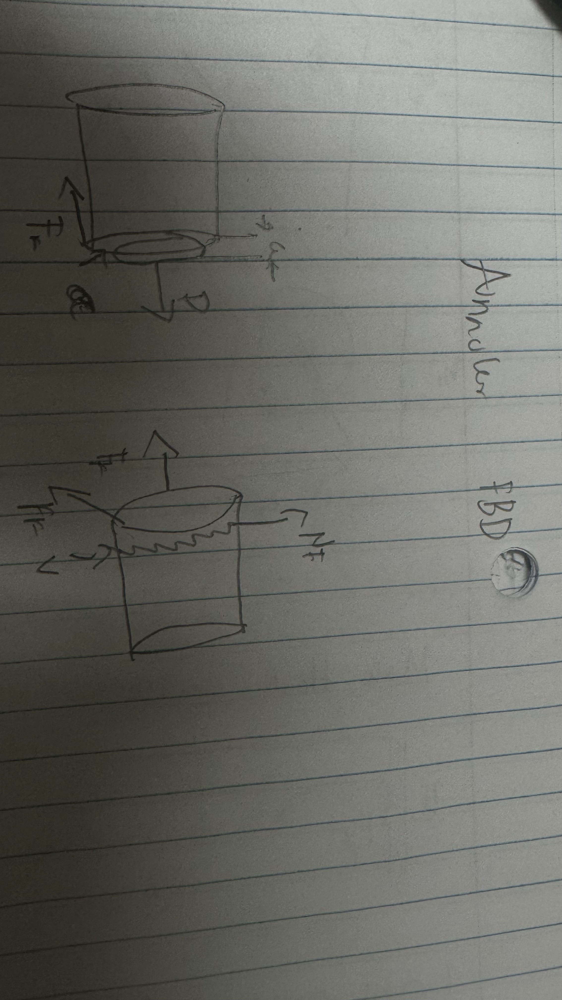
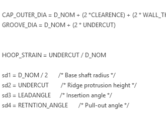
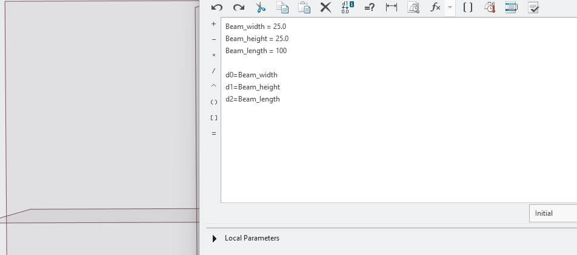
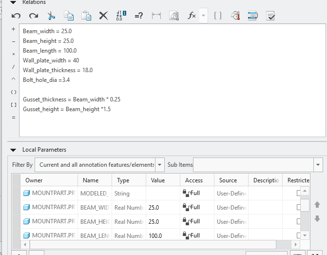
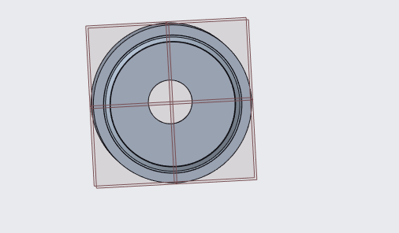
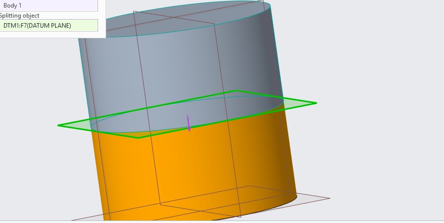
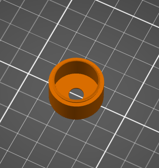
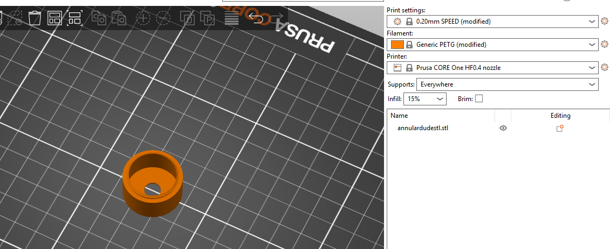

# A6 – [Design Fits For An Artifact]

## Beginning and Lab5 

I decided with this design that I would use the same thing I made the last week. I designed this to work for a motor so I think my overall 
design would be perfect for this and thankfully it was. When it comes to the parametric design I just redid the same equations I already had for last week as those values were made to fit the motor I had. 

The pictures below show the parametric designing process. 

## FBD 
<figure>
  
  <figcaption><i> Figure 1: This is my second freebody diagram.  </i></figcaption>
</figure>   

Though this is the same free body diagram the math was created for this part so it still sticks.

## Parametric Cad Settings 

This is when I was first inputting the equations that govern the design

<figure>
  
  <figcaption><i>Figure 2: This shows the equations mentioned above and how they helped aid in the creo design.</i></figcaption>
</figure>  

This shows how the equations aided in the design of my creo project. 

<figure>
  
  <figcaption><i>Figure 3: This shows the equations mentioned above were used in the string values.</i></figcaption>
</figure>  

This second picture shows more about how I had to create the design parametrically, this saved me a bit of time having these equations 
from the last lab. 

<figure>
  
  <figcaption><i>Figure 4: This shows the equations mentioned above and more on how they helped.</i></figcaption>
</figure>  

## Cad Designing 

The only problem I had with this was going into it my annular design from the last week didn't have a open top and since that as the only
part blocking the motor from being a snap fit I decided to extrude this in cad. 
Leaving the designs the same and trying to rush the prints was my own fault I realize now that I should've put more thought into how that design choice would translate.

Below the cad extrude can be shown. 

<figure>
  
  <figcaption><i>Figure 5: This shows the extrude that helps stick the outer point of the motor so it won't break the snapping part.</i></figcaption>
</figure> 

This was the only real change I had to add to the design below are pictures of the L5 lab and how it looked being created just for the sake of documentation. 

<figure>
  
  <figcaption><i>Figure 6: This shows the starting body from the originial part.</i></figcaption>
</figure> 

<figure>
  
  <figcaption><i>Figure 7: This shows the snap of the orignial part.</i></figcaption>
</figure> 

## Documentation

Below a video of the cad model being sliced and a video of the prusa slicer printer can be seen. 

<figure>
  
  <figcaption><i>Figure 8: This shows the extrude that helps stick the outer point of the motor so it won't break the snapping part.</i></figcaption>
</figure> 

<figure>
  
  <figcaption><i>Figure 9: This shows the extrude that helps stick the outer point of the motor so it won't break the snapping part.</i></figcaption>
</figure> 

## Video of Printing  
This video below shows the printing in the 3d printing. 
<figure>
  <video controls width="500" height="500">
    <source src="202609291204.mp4" type="video/mp4">
    Your browser does not support the video tag.
  </video>
  <figcaption><i> Figure 10: 3d Print coming alive </i></figcaption>
</figure>  

## What helped create this 
Heres a list of websites that helped: 

<ul>
  <li><a href="https://www.youtube.com/watch?v=QS4LHS7S8o4&t=1s">How to edit bodies in creo</a></li>
  <li><a href="https://community.ptc.com/3d-part-assembly-design-327/subtracting-one-body-part-from-another-body-part-88487">How to remove bodies in creo</a></li>  
  <li><a href="https://community.ptc.com/creo-parametric-tips-390/multibody-how-do-i-position-bodies-131921">Positioning bodies in creo</a></li>  
  <li><a href="https://support.ptc.com/help/creo/creo_pma/r12/usascii/index.html#page/part_modeling/part_modeling/To_Copy_Move_Mirror_or_Pattern_Bodies.html#">How to copy bodies in creo</a></li>
  <li><a href="https://support.ptc.com/help/creo/creo_pma/r12/usascii/index.html#page/part_modeling/part_modeling/to_split_bodies.html">How to spilt bodies in creo</a></li>
  <li><a href="https://www.youtube.com/watch?v=SvI8qrdAr1w">Creating annular snapfits in fusion360</a></li>
</ul>

