# L07 – [Linkage Designs]

## Research 

<ol>
  <li> Adaptive Underactuated 6-Bar Linkage Mechanism
  <ul>
    <li> Patent created in 2022 according to ASME Journal of Mechanism and Robotics</li> 
    <li> Unlike traditional rigid linkages that require individual motors for each joint,
      this 6-bar linkage utilizes a single drive input connected to a primary crank.
      The remaining five linkages form a closed loop with dynamic floating pin joints and internal passive springs.</li>
    <li>Prosthetics are one use as in bio-inspired prosthetic hands. Driven by a single motor or body-powered tension cable, the mechanism enables user-adaptive power and precision grips across complex daily objects using minimal actuation hardware.</li>
    <li>Another use comes from automated warehousing as it allows automated sorting arms to grip items of varying shapes and fragilities (e.g., produce, bottles, soft packaging) without crushing them or requiring gripper changeouts.</li>
  </ul>
  </li>
</ol>

__Sources for 1__

<a href="https://asmedigitalcollection.asme.org/mechanismsrobotics/article-abstract/16/11/111005/1198680" target="_blank">ASME Journal</a>

<a href="https://patents.google.com/patent/WO2024073138A1/en" target="_blank">Google Patent</a>

<a href="https://www.mdpi.com/2075-1702/14/2/175" target="_blank">Peer reviewed article</a>

<ol>
  <li> Monolithic Compliant Constant-Force Linkage
  <ul>
    <li> Published in Mechanism and Machine Theory in 2021 and patented in 2023 (US Patent US11,629,773B2)</li>
    <li> The way it is used is the entire mechanism is manufactured as a single monolithic component. Motion is achieved through elastic deflection of thin flexible beam sections according to its patent.</li>
    <li> One use found is employed in satellite solar array deployment latches, antenna tensioners, and optical mirror dampeners. So the aerospace industry.</li>
    <li>Another use comes from sub-micron wafer positioning stages and wire-bonding equipment. This is how semi-conductor manuifacturing industry</li>
  </ul>
  </li>
</ol>

__Sources for 2__

<a href="https://doi.org/10.1115/1.4053210" target="_blank">ASME Journal of Mechanisms and Robotics</a>

<a href="https://doi.org/10.1016/j.mechmachtheory.2021.104350" target="_blank">Mechanism and Machine Theory</a>

<a href="https://pmc.ncbi.nlm.nih.gov/articles/PMC12301602/">U.S. Patent</a>

## My Design

The purpose of my design was to create an adjustable scissor design, this will be used in future projects for me when I create a scissor lift. When creating this I only needed to create two parts the linkages themselves and the connection pins. 

<table>
  <thead>
    <tr>
      <th>Connection</th>
      <th>Pin</th>
    </tr>
  </thead>
  <tbody>
  <tr>
      <td>Function: Snapping to the pins and moving at angles to create a scissor design</td>
      <td>Printed</td>
    </tr>
    <tr>
      <td>Snapping into the connector pieces and supporting weight of other pins.</td>
      <td>Printed</td>
    </tr>
  </tbody>
</table>

## Tolerances

I designed the pieces to be tolerant in cad and was going to test how the different prints reacted with the cad design. I thought that
creating a tight fit i.e. having the holes be the same diameter of the pins I would get a better snap fit as I learned from my 
annular designs of the last two weeks. 

## Three Key Points 

<ol>
  <li>Multiple holes on connections: I did multiple holes for the connection pieces so I could vary what length was needed for
  the connection</li>
  <li>Creating a split down the hole of the pin: This was done to relieve stress as I learned from a youtube video it can help 
  the design last longer with the connection pieces as I was worried I'd have to print multiple times. </li>
  <li>Large tips for the ends of the pins: I wanted the ends of my pins to be a little bigger so I'd be able to grab them when I connected my pieces.</li>
</ol>

## Cad Designs 

To start I created a new part file in creo this would be for the creation of the connection pieces (scissor of the design). 
Below an image of what it looks like can be shown. I started with two circles and just connected them by two lines to create the entire pieces. 

<figure>
  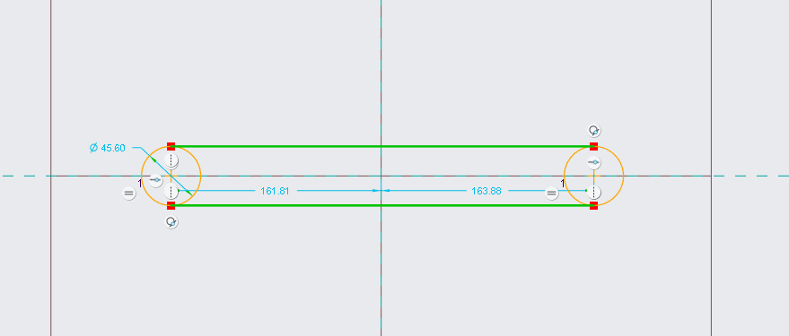
  <figcaption><i>Figure 1: This shows the connection of the two circles.</i></figcaption>
</figure> 

Next I would extrude this part to give the piece a thickness I would be careful not to create a part too thick otherwise the pins would have to be extra long. Keeping that in mind what I came up with is below. 

<figure>
  
  <figcaption><i>Figure 2: This shows the connection of the two circles.</i></figcaption>
</figure> 

Then I would change the extrude length to be something a little less thick so I wouldn't have to trouble myself with changing the pins 
connections later. The smaller the length of my extrude the less long I would have to create the pins. 
<figure>
  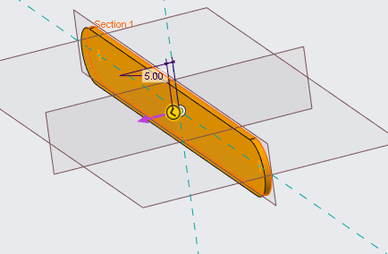
  <figcaption><i>Figure 3: This shows the change in extrude length.</i></figcaption>
</figure> 

Next I would begin to add the holes, I would go the the modeling tab and press on holes. This way I could create the first hole for the pattern that would be set in a linear fashion. 

<figure>
  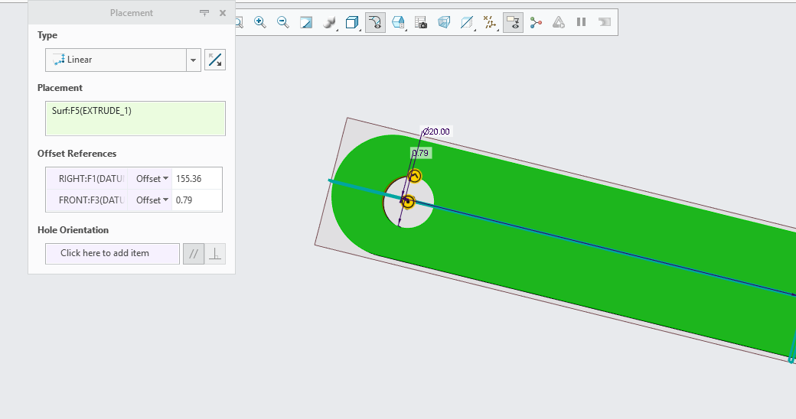
  <figcaption><i>Figure 4: This shows the hole being created.</i></figcaption>
</figure> 

Next I would begin to add the pattern to the holes making sure to stop when the first hole and the fifth hole are at an equal distance away from the edges of the parts. I did this so my parts when printed could be of equal length. 

<figure>
  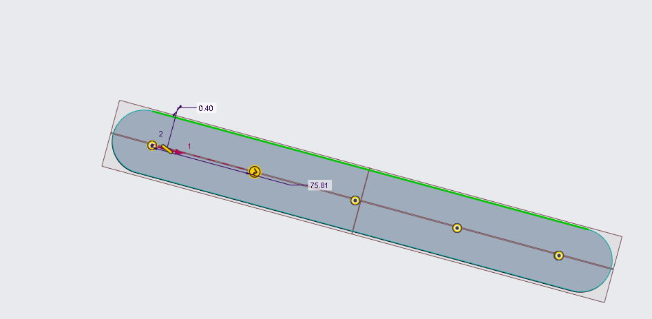
  <figcaption><i>Figure 5: This shows the pattern in holes.</i></figcaption>
</figure> 

Finally I would then extrude these holes so it could cut through the material and create the design I was looking for. The creation of this design would dictate how the pins are connected. 

<figure>
  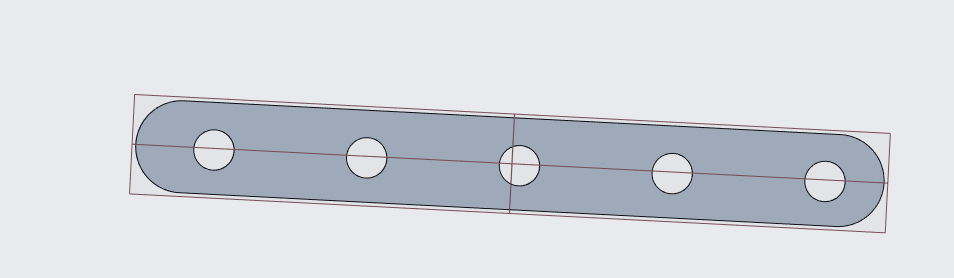
  <figcaption><i>Figure 6: This shows the holes after being extruded.</i></figcaption>
</figure> 

## Pin Design 

I would then being on the pins connection the pieces together starting with a diameter the same size as on of the holes I extruded since they are all of equaling I chose the first hole. After that I would create a new sketch and place down a circle for the pins base. 

<figure>
  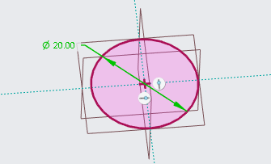
  <figcaption><i>Figure 7: This shows the base of the pin design.</i></figcaption>
</figure> 

After placing down the first hole I would being to create the next extrusion for the hole, this would be around 3 times the distance of the parts as I wanted the pin to be able to fit 3 connections if need be. 

<figure>
  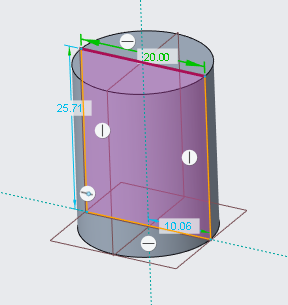
  <figcaption><i>Figure 8: This shows the base of the pin being extruded.</i></figcaption>
</figure> 

After this I would cut around the datum plane to create a new hole in the center of the pin, this would allow for the pin to have more survivability in the long run. 

<figure>
  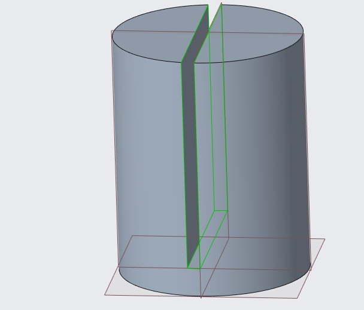
  <figcaption><i>Figure 9: This shows the base of the pin being cut.</i></figcaption>
</figure> 

After this I could create the part that would allow me to move the pins with my fingers comfortably by creating a bigger circle to act as a slider for the pieces. 

<figure>
  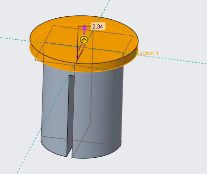
  <figcaption><i>Figure 10: This shows the slider being created.</i></figcaption>
</figure> 

With that being done I went on to assemble the parts in creo parametric 

## Assembly 

First I would place down both the pin and connection pieces in to the creo assembly designs as shown below, 

<figure>
  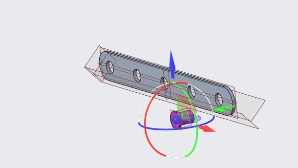
  <figcaption><i>Figure 11: This shows the assembly being created.</i></figcaption>
</figure> 

After this I would being to constrain the two pins to see if they would even fit together as I know if they fit together then I can create multiple prints of just these two pieces to create the scissors.

<figure>
  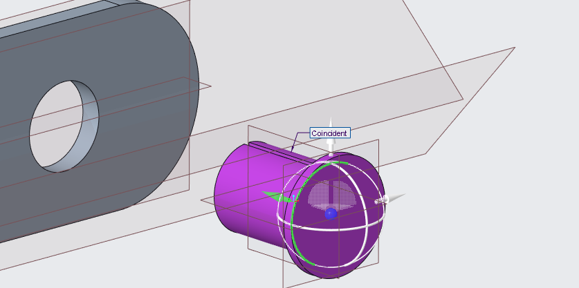
  <figcaption><i>Figure 12: This shows the assembly being constrained.</i></figcaption>
</figure> 

Finally I would check to see if this work and if all constraints were met and which they were meaning I could move onto the final part of slicing this. 

<figure>
  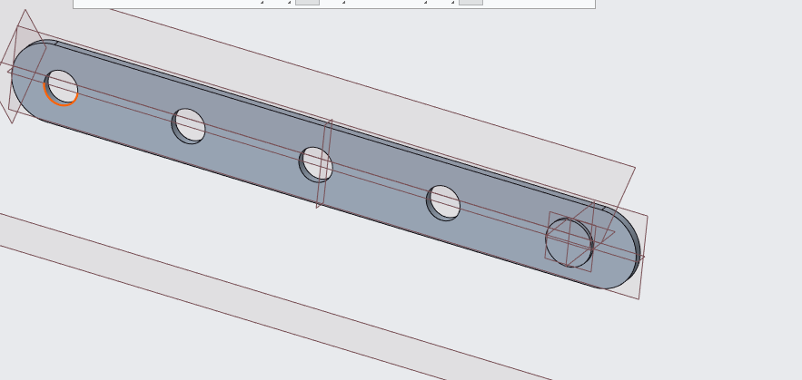
  <figcaption><i>Figure 13: This shows the assembly being put together.</i></figcaption>
</figure> 

## Decide

## Communicate

